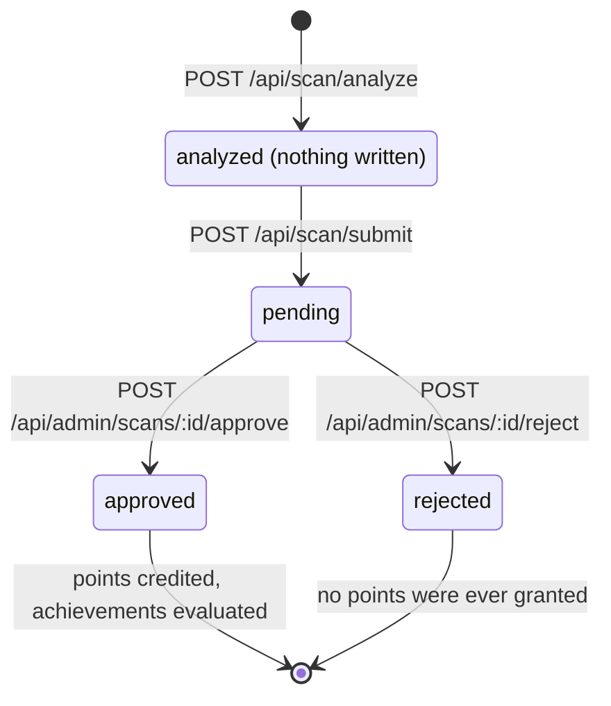
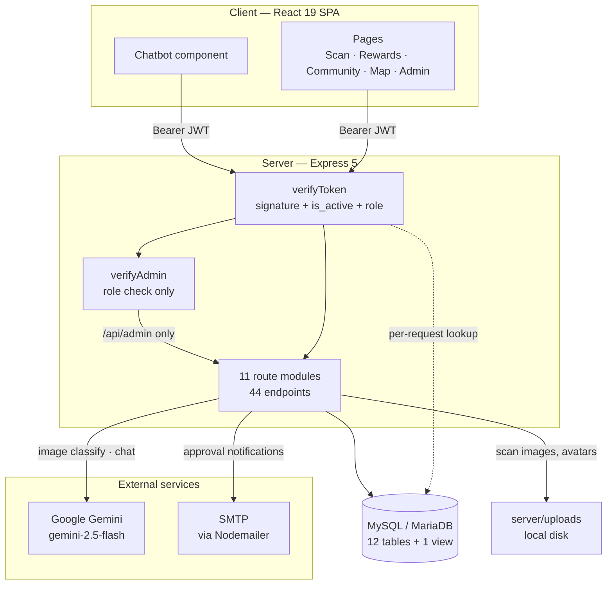
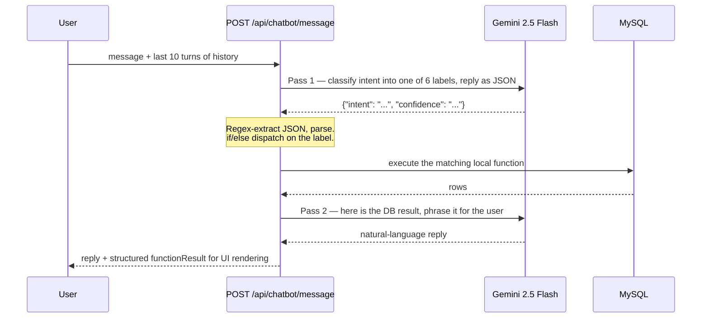

# EcoReward Hub

A recycling rewards web app. Users photograph a recyclable item, Google Gemini classifies it, an admin verifies the submission, and points are credited. Points buy Touch 'n Go reloads, vouchers, and merchandise. A conversational assistant can read a user's balance and complete a redemption end to end.

**Stack:** React 19 + Vite 7 + MUI 7 · Express 5 + MySQL · Google Gemini (`gemini-2.5-flash`) for both image classification and the chat assistant.

**Scope:** 44 REST endpoints across 11 route modules, 12 tables + 1 view, JWT auth with role-based admin separation, verification queues for scans and redemptions, transactional email.

**Docs:** [API reference](docs/API.md) · [Database schema](docs/SCHEMA.md) · [Tech stack](docs/STACK.md) · [Security](docs/SECURITY.md) · [Setup](docs/SETUP.md) · [Engineering notes & limitations](docs/ENGINEERING.md)

<!-- demo video link goes here -->

<!-- screenshots / demo GIF go here: scan → classify → submit · admin verification queue · chatbot redemption · facility map -->

---

## What it does

Points are never awarded by the AI alone — classification and crediting are deliberately separated:

1. **`POST /api/scan/analyze`** — image uploaded, sent to Gemini, classified. No database write, no points; the result goes back to the client.
2. **`POST /api/scan/submit`** — user picks a drop-off facility. A `scans` row is written as `pending`. Still no points.
3. **`POST /api/admin/scans/:id/approve`** — an admin reviews the image. Only now are points credited, `total_scans` incremented, achievements evaluated, and email sent.



The classification is done by the model; the crediting is done by a person. `analyze` writes nothing at all — the result exists only in the client's hands until the user chooses to submit it — and `users.total_points` is written in exactly one place on this path, inside the transaction in `approve`. A misclassification therefore cannot turn into points without an admin having looked at the image it came from. Submission is not entirely without effect, only without *points*: it writes the `scans` row, increments `item_type_stats.total_scanned`, and advances the daily streak.

Rejection marks the scan `rejected`; since points were never granted, nothing is reversed. Points are `round(base_points × confidence)`, with `base_points` from `item_type_stats` (E-waste 25 down to Organic 5).

Redemptions use the same pending-then-approve shape, except points are deducted at request time so a pending redemption cannot be double-spent — approval issues a voucher code, rejection refunds.

Also: daily streaks with a one-day grace allowance, six achievements, a leaderboard backed by a SQL view, a 280-character community timeline, a facility locator using a Haversine expression evaluated in SQL, and an admin dashboard with an AI audit view for scans below 0.7 confidence.

Full endpoint reference: **[docs/API.md](docs/API.md)**

---

## Tech stack

React 19 · Vite 7 · MUI 7 · React Router 7 · Recharts on the client; Express 5 · mysql2 · jsonwebtoken · bcrypt · Passport (Google OAuth 2.0) · multer · nodemailer on the server; `@google/genai` for Gemini. No `engines` field is declared in either manifest — developed on **Node v24.15.0**, with Express 5 and Multer 2 setting a floor of Node ≥ 18. Database is MySQL ≥ 8.0 or MariaDB ≥ 10.2 (the schema uses a window function and inline `CHECK (json_valid(...))`).

Full dependency tables with exact declared versions: **[docs/STACK.md](docs/STACK.md)**

---

## Architecture

```
ecoreward-hub/
├── client/src/
│   ├── pages/         # Welcome, Login, Register, Dashboard, Scan, Rewards,
│   │                  # Community, Map, Leaderboard, Profile, Admin
│   ├── components/    # BottomNav, Chatbot, PostCard, CreatePostDialog, ProtectedRoute
│   └── animations/    # Lottie JSON
├── server/
│   ├── config/        # db.js (pool) · gemini.js (classification) · email.js
│   ├── middleware/    # verifyToken.js (authn) · verifyAdmin.js (authz)
│   ├── routes/        # 11 modules, 44 endpoints
│   ├── uploads/       # scan images, avatars, post images (local disk, not committed)
│   └── server.js
└── docs/              # API.md · SCHEMA.md · ENGINEERING.md · DEVLOG.md
```



A React SPA talking to a stateless Express API over JSON, MySQL holding all state, uploads on the API server's local disk.

The middleware chain is the part worth calling out. `verifyToken` is the single authentication implementation: it validates the JWT signature, then reads `is_active` and `role` from the database on every protected request. `verifyAdmin` verifies nothing itself — it only answers "is this authenticated caller an admin?". Admin routes mount both, `router.use(verifyToken, verifyAdmin)`. Why that structure matters: [ENGINEERING.md § 3](docs/ENGINEERING.md#3-a-ban-that-did-nothing--and-the-duplicate-that-caused-it).

Field-level schema: **[docs/SCHEMA.md](docs/SCHEMA.md)**

---

## AI implementation

Gemini is used in two distinct places. Neither uses the Gemini function-calling / tools API — see the honest description below.

### 1. Image classification — `server/config/gemini.js`

`analyzeWasteItem(imagePath)` reads the file, base64-encodes it, and sends it inline with a prompt that pins the output to a fixed JSON shape:

```json
{
  "type": "Plastic|Metal|Glass|Paper|Organic|E-waste|Non-recyclable",
  "subtype": "PET Bottle",
  "confidence": 0.95,
  "recyclable": true,
  "tips": "…"
}
```

Because the model sometimes wraps JSON in a markdown fence, the response is stripped of fences before parsing, the presence of `type` / `subtype` / `confidence` is asserted, and `confidence` is clamped to `[0, 1]`. On any failure the function returns `success: false` with a neutral fallback object rather than throwing.

### 2. Conversational assistant — `server/routes/chatbot.js`

**This is not Gemini function calling.** A `functionDeclarations` array exists in the file (`chatbot.js:261-307`) with four entries and correct schemas, but it is never passed to the SDK — grep the server tree and its only occurrence is its own declaration. Neither `generateContent()` call sends a `tools` parameter. What actually runs is a hand-built three-stage pipeline:



**Pass 1 — intent classification.** A prompt asks the model to sort the message into `getUserPoints`, `getAffordableRewards`, `getAvailableRewards`, `redeemReward`, `confirmRedemption`, or `general`, and to answer in JSON. The reply is matched with `/\{[\s\S]*\}/` and `JSON.parse`d. A parse failure is caught and downgrades the turn to `general`.

**Dispatch.** A plain `if/else` chain (`chatbot.js:413-548`) maps the label onto one of four local functions. The `general` label skips the database entirely and goes to a normal chat completion.

**Pass 2 — formatting.** The database result is embedded in a second prompt and the model turns it into two or three sentences. The raw result is *also* returned to the client as `functionResult`, so the UI renders real point balances and reward cards from data rather than from parsed prose.

### The four functions

All four query the database directly; none of them let the model invent numbers.

| Function | Arguments | What it does |
|---|---|---|
| `getUserPoints(userId)` | `userId` from the JWT | `SELECT total_points, lifetime_points FROM users WHERE user_id = ?` |
| `getAvailableRewards()` | none | Active rewards ordered by cost ascending |
| `getAffordableRewards(userId)` | `userId` from the JWT | Reads the balance, then selects rewards with `points_cost <= ?`; the route also fetches the full catalogue so the reply can say how far off the user is |
| `redeemReward(userId, rewardId)` | `userId` from the JWT, `rewardId` | Full redemption, described below |

**`userId` always comes from `req.user.user_id`, never from the model or the request body.** The model cannot address another user's account, because it never supplies the identity.

### Server-side re-validation in `redeemReward`

The model's role stops at deciding that a redemption was requested. Every fact it might have gotten wrong is re-checked against the database inside a transaction (`chatbot.js:148-254`):

```js
const connection = await db.getConnection();
await connection.beginTransaction();
// 1. re-read the reward, requiring is_active = 1     → rollback if missing
// 2. stock check (stock_quantity !== -1 && <= 0)     → rollback if empty
// 3. re-read total_points FROM users                 → never trust the conversation
// 4. balance check against points_cost               → rollback if short
// 5. deduct points, decrement stock, insert 'pending' redemption
await connection.commit();
```

`catch` rolls back, `finally` releases the connection. The conversation history is treated as untrusted input throughout: a user who talks the model into believing they have 10,000 points still fails at step 4.

**What this does not protect against:** the reads are plain `SELECT`s, not `SELECT ... FOR UPDATE`, and the deduction is not guarded by `WHERE total_points >= ?`. Two concurrent redemptions can both pass step 4 and drive the balance negative. See [Limitations](#limitations).

### Reward resolution is brittle

When the user names a reward, the ID is resolved by hardcoded regex (`chatbot.js:456-471`), and when they say "yes" the same patterns are re-run over the last three history messages (`chatbot.js:488-513`):

```js
if (lowerMessage.match(/coffee|voucher/i))      { rewardId = 5; }
else if (lowerMessage.match(/tote\s*bag|bag/i)) { rewardId = 4; }
// … RM20 → 3, RM10 → 2, RM5 → 1
```

These IDs are pinned to the seeded catalogue. Adding or reordering rewards silently breaks the mapping. Pass 1 already asks the model to extract `reward_id`, but the dispatch code ignores that field and re-derives it here. This is the weakest part of the feature and is the first thing the tools API would replace.

---

## Security

Authentication has one implementation. `verifyToken` validates the JWT signature, then reads `is_active` and `role` from the database on every protected request — so a ban or a demotion takes effect on the next call rather than at token expiry, and the JWT claim is treated as a login-time snapshot only. `verifyAdmin` compares `req.user.role` to `'admin'` and does nothing else. Registration hardcodes `role = 'user'`; the server never reads a role from a request body. Both middleware fail closed.

Also implemented: bcrypt at 10 rounds, bound parameters for every user-supplied value, `NODE_ENV`-gated error detail across 14 call sites, single-origin CORS, multer MIME allowlists with a 5 MB cap, explicit transactions on every multi-write path, and composite primary keys that make double-liking and double-unlocking impossible at the storage layer.

Full table with file and line references: **[docs/SECURITY.md](docs/SECURITY.md)**

### Known gaps

| Gap | Detail |
|---|---|
| No rate limiting | No `express-rate-limit`, no `helmet`. Auth and both Gemini-backed routes are unthrottled; the chat endpoint makes two model calls per message |
| Development-only secret handling | `server.js:49` falls back to a constant for the session secret, and the dev `JWT_SECRET` is a word-list passphrase, not CSPRNG output. Both must be resolved before deployment — [ENGINEERING.md § 4](docs/ENGINEERING.md#4-secret-handling-a-deliberate-development-boundary) |
| Unauthenticated uploads | `/uploads/*` served by `express.static` with no access control; filenames are predictable (`scan_YYYYMMDD_HHMMSS_<userId>.jpg`) |
| No token revocation | Logout is client-side only. Bans and demotions are caught per request, but a stolen token stays valid for its full 7 days |

---

## Engineering notes

Five problems that actually happened. Full write-ups with verification tables: **[docs/ENGINEERING.md](docs/ENGINEERING.md)**

**1. `LIMIT` placeholders and `ER_WRONG_ARGUMENTS`.** Six paginated endpoints returned 500 on every call with `ER_WRONG_ARGUMENTS (1210)`. `mysql2`'s `execute()` uses the binary prepared-statement protocol, which will not accept a parameter marker in the `LIMIT`/`OFFSET` position — the identical SQL works through `pool.query()`, so nothing in the query text looks wrong. Fixed with `parseInt` + clamp + inline: what reaches the template literal is always a bounded integer, never a string derived from user input, so there is no injection path and the clamp doubles as a DoS guard. Trade-off: a pattern that looks unsafe on sight, now dependent on a comment to stay defensible under review.

**2. Anyone could register as an administrator.** Self-audit finding: `POST /api/auth/register` read `isAdmin` from the request body, and the registration page shipped it as a visible checkbox. The `verifyAdmin` middleware was correct throughout — the server simply *issued* the admin role on demand, so the guard held the door while the window beside it stood open. Fixed by deleting the field and hardcoding `role = 'user'`. Trade-off: no in-app path to create an admin any more; it takes a manual `UPDATE`, which at this size is the right shape.

**3. A ban that did nothing.** `toggle-status` set `is_active = 0`, but banned users kept working tokens for up to seven days because `verifyToken` only checked the signature. Worse, `verifyAdmin` was a *second, independent* authentication implementation, so adding the `is_active` lookup to `verifyToken` fixed `/api/user/*` and left all twelve admin endpoints exposed — one copy updated, the other not. Fixed by removing the duplication rather than copying the lookup: `verifyToken` became the sole authenticator and now reads `is_active` and `role` per request, `verifyAdmin` shrank to a role comparison, and admin routes chain both. Trade-off: one primary-key `SELECT` on every authenticated request, accepted because a ban that does not take effect is worse than a few milliseconds.

**4. Secret handling.** The express-session secret falls back to a constant written in the source, and the development `JWT_SECRET` is a nine-word lowercase passphrase rather than CSPRNG output. Both are scoped to local development, where the fallback lets a fresh clone boot without a fully populated `.env`; the JWT signing path has no fallback and throws instead. Rather than half-fixing it, the boundary is stated: remove the fallback and regenerate the secret from `crypto.randomBytes(32)` before any deployment. Trade-off: a misconfigured production environment should refuse to boot, which is exactly what a first-time local checkout does not want.

**5. A refund that could be collected twice.** `POST /api/admin/redemptions/:id/reject` refunded `points_spent` without ever looking at the current status, so calling it again refunded again — three clicks took a test account from 800 points to 1400. The transaction was real; atomicity is not idempotence. Auditing the sibling endpoints found the same shape three more times: `approve` refused only `completed` and so allowed `cancelled → completed` (refund kept *and* voucher issued), scan approval had no state check at all and re-credited on every call, and scan rejection could flip an approved scan while its points stayed. Fixed by folding the state check into the write — `UPDATE ... WHERE id = ? AND status = 'pending'`, with `affectedRows` as the authority — so there is no window between checking and writing, and conflicts return 409 instead of 500. Trade-off: it makes the transition idempotent, not the balance; the concurrent-spend race in `redeem` is a different bug and stays open below.

---

## Limitations

The four that matter most. Full list — redemption-code lifecycle split, `Non-recyclable` ENUM mismatch, unenforced schema columns, drifting counters, hardcoded achievements, a dead table — in **[docs/ENGINEERING.md § Limitations](docs/ENGINEERING.md#limitations)**.

**No test coverage.** No test files, no framework in either manifest, and `npm test` in `server/` is the placeholder that exits 1. Everything here was verified by hand against a running server and a live database. This is the largest gap, and it is directly responsible for note 3 — nothing caught that a security fix had landed in one of two duplicated paths.

**No rate limiting.** Login, registration, and both Gemini-backed endpoints are unthrottled.

**Race condition in redemption.** Both redemption paths read balance and stock, check, then write, with no `SELECT ... FOR UPDATE` and no `WHERE total_points >= ?` guard on the deduction. Under REPEATABLE READ two concurrent requests can both pass the check and drive the balance negative — the transactions guarantee atomicity, not serialisability.

**Images on local disk, no access control.** Uploads land in `server/uploads/` on the API server: no object store, nothing survives a rebuild, and `/uploads/*` is served unauthenticated with predictable filenames.

> **Classification accuracy is not measured.** No held-out evaluation has been run. A credible table needs labelled photographs, per-category precision and recall, and a confidence-versus-correctness curve to justify the 0.7 audit threshold. Until that work exists, no accuracy figure is claimed anywhere in this documentation.

---

## Roadmap

1. **Tests** — auth middleware, the redemption transaction, and admin approval flows first; that is where the bugs above lived.
2. **Fix the redemption race** — row locks, or a conditional `UPDATE` with an affected-row check.
3. **Harden secrets** — remove the fallback, regenerate `JWT_SECRET` from a CSPRNG.
4. **Rate limiting** — auth endpoints and both Gemini-backed routes.
5. **Wire up the Gemini tools API** — the four `functionDeclarations` are written and correctly shaped but never passed to the SDK. Connecting them replaces the hand-rolled intent classifier and the hardcoded reward-name regex with real tool dispatch, and allows multiple tools in one turn: "what can I afford, and redeem the cheapest one" cannot work in a single message today.
6. **Uploads to object storage** with signed URLs, removing the unauthenticated `/uploads/*` surface.
7. **Data-driven achievements** — read `requirement_type` / `requirement_value` from the table instead of hardcoding conditions in two places.

---

## Running it locally

**Prerequisites:** Node.js ≥ 18 (developed on v24), MySQL ≥ 8.0 or MariaDB ≥ 10.2, a Google Gemini API key. Google OAuth, Maps, and SMTP are optional — the app runs without them, only those features are disabled.

```bash
mysql -u root -p -e "CREATE DATABASE ecoreward_db;"       # then build the schema — see below

cd server && npm install && cp .env.example .env          # then fill in .env
npm run dev                                               # API on :5000

cd client && npm install && cp .env.example .env          # optional — Maps key
npm run dev                                               # app on :5173
```

**The database dump is not distributed with this repository.** The working dump held real user rows — addresses and bcrypt password hashes — so it is excluded rather than scrubbed. Every table, column, type, constraint, index, and foreign key is documented in **[docs/SCHEMA.md](docs/SCHEMA.md)**, which is sufficient to recreate the schema; the seed rows the app expects (item types, achievements, rewards, facilities) are described there too.

Environment variables, admin provisioning, install verification, and troubleshooting: **[docs/SETUP.md](docs/SETUP.md)**

---

## License

MIT — see [LICENSE](LICENSE).
