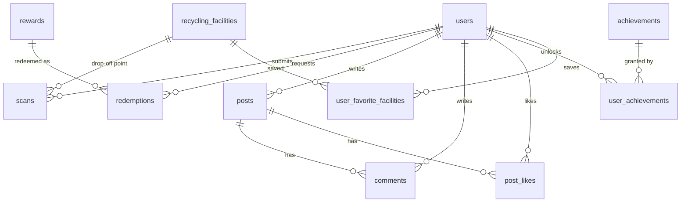
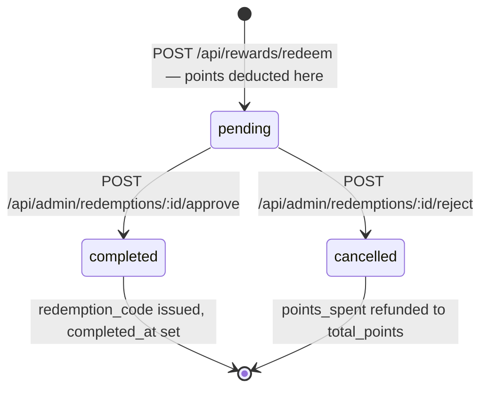

# Database Schema

12 base tables and 1 view. InnoDB, `utf8mb4_unicode_ci`, foreign keys enforced.

The SQL dump is not distributed with this repository — it contained real user rows, including addresses and bcrypt password hashes. This document is the authoritative schema reference in its place: every table, column, type, constraint, index, and foreign key below is transcribed from the working database.

Two columns use MariaDB-style inline JSON validation — `scans.gemini_raw_response` and `recycling_facilities.opening_hours` both carry `CHECK (json_valid(...))`.

← back to [README](../README.md) · [API reference](API.md)

---

## Entity relationships



`scans.verified_by` is a second foreign key from `scans` back to `users`, recording which admin approved or rejected the submission. It is omitted from the diagram above to keep the `users → scans` edge readable.

---

## `users`

| Column | Type | Notes |
|---|---|---|
| `user_id` | `int(11)` | PK, auto-increment |
| `username` | `varchar(50)` | UNIQUE, NOT NULL |
| `email` | `varchar(255)` | UNIQUE, NOT NULL |
| `role` | `enum('user','admin')` | DEFAULT `'user'`. Never set from a request body |
| `password_hash` | `varchar(255)` | **NULLABLE** — Google-only accounts have no password |
| `google_id` | `varchar(255)` | UNIQUE, nullable |
| `profile_picture` | `varchar(500)` | Local path, or a Google-hosted URL for OAuth accounts |
| `total_points` | `int(11)` | DEFAULT 0. Spendable balance |
| `lifetime_points` | `int(11)` | DEFAULT 0. Never decremented; drives achievements |
| `total_scans` | `int(11)` | DEFAULT 0. Approved scans only |
| `current_streak_days` | `int(11)` | DEFAULT 0 |
| `longest_streak_days` | `int(11)` | DEFAULT 0. Maintained with `GREATEST()` on update |
| `last_scan_date` | `date` | Streak anchor; set on submission, not approval |
| `streak_grace_used` | `tinyint(1)` | DEFAULT 0. One forgiven gap per streak |
| `is_active` | `tinyint(1)` | DEFAULT 1. `0` = banned; checked on every authenticated request |
| `created_at` | `timestamp` | DEFAULT `current_timestamp()` |
| `last_login` | `timestamp` | `ON UPDATE current_timestamp()` |

**Indexes** — PK `user_id`; UNIQUE on `username`, `email`, `google_id`; `idx_email`, `idx_google_id`, `idx_leaderboard (total_points)`.

`password_hash` being nullable is what makes the dual auth paths work: a Google account has `google_id` set and `password_hash NULL`, and the login route refuses it with a message pointing at Google Sign-In rather than a generic credential error.

---

## `scans`

| Column | Type | Notes |
|---|---|---|
| `scan_id` | `int(11)` | PK, auto-increment |
| `user_id` | `int(11)` | FK → `users`, ON DELETE CASCADE |
| `item_type` | `enum('Plastic','Metal','Glass','Paper','Organic','E-waste')` | NOT NULL |
| `item_subtype` | `varchar(100)` | Free text from Gemini, e.g. "PET Bottle" |
| `confidence_score` | `float` | NOT NULL, 0.0–1.0 |
| `points_earned` | `int(11)` | NOT NULL. Computed at analyze time, granted at approval |
| `image_path` | `varchar(500)` | Path under `/uploads` |
| `facility_id` | `int(11)` | FK → `recycling_facilities` (no cascade) |
| `gemini_raw_response` | `longtext` | `CHECK (json_valid(…))`. Full model output, retained for auditing |
| `recycling_tips` | `text` | |
| `location_lat` | `decimal(10,8)` | Nullable, never populated |
| `location_lng` | `decimal(11,8)` | Nullable, never populated |
| `verification_status` | `enum('pending','approved','rejected')` | DEFAULT `'pending'`. Lifecycle diagram in the [README](../README.md#what-it-does) — points are credited only on the transition to `approved` |
| `verified_by` | `int(11)` | FK → `users`. The approving admin |
| `verified_at` | `timestamp` | Nullable |
| `scan_timestamp` | `timestamp` | DEFAULT `current_timestamp()` |

**Indexes** — PK `scan_id`; `idx_user_history (user_id, scan_timestamp)`, `idx_item_stats (item_type)`, `facility_id`, `verified_by`.

Keeping `gemini_raw_response` means every classification decision is reconstructable after the fact — useful for the admin audit view, and the reason the column is JSON-validated on write rather than stored as opaque text.

---

## `rewards`

| Column | Type | Notes |
|---|---|---|
| `reward_id` | `int(11)` | PK, auto-increment |
| `reward_name` | `varchar(100)` | NOT NULL |
| `description` | `text` | |
| `reward_image` | `varchar(500)` | Nullable, never populated |
| `points_cost` | `int(11)` | NOT NULL |
| `reward_type` | `enum('tng_cashback','voucher','discount','physical_gift')` | NOT NULL |
| `reward_value` | `decimal(10,2)` | Cash value where applicable |
| `stock_quantity` | `int(11)` | DEFAULT `-1` = unlimited (sentinel) |
| `max_per_user` | `int(11)` | DEFAULT `-1`. **Declared, not enforced by any route** |
| `valid_from` | `date` | **Declared, not enforced** |
| `valid_until` | `date` | **Declared, not enforced** |
| `is_active` | `tinyint(1)` | DEFAULT 1 |

**Indexes** — PK `reward_id`; `idx_active_catalog (is_active, points_cost)`, which covers the catalogue query exactly.

---

## `redemptions`

| Column | Type | Notes |
|---|---|---|
| `redemption_id` | `int(11)` | PK, auto-increment |
| `user_id` | `int(11)` | FK → `users`, ON DELETE CASCADE |
| `reward_id` | `int(11)` | FK → `rewards` (no cascade — rewards are not deleted) |
| `points_spent` | `int(11)` | NOT NULL. Snapshot of cost at request time |
| `redemption_code` | `varchar(50)` | UNIQUE, **nullable**. Nullable-unique is deliberate: the REST path leaves it NULL until approval |
| `status` | `enum('pending','completed','cancelled')` | DEFAULT `'pending'` |
| `redeemed_at` | `timestamp` | DEFAULT `current_timestamp()` |
| `completed_at` | `timestamp` | Nullable. Set on approval |

**Indexes** — PK `redemption_id`; UNIQUE `redemption_code`; `reward_id`, `idx_user_history (user_id, redeemed_at)`.



`status` looks like `scans.verification_status` and behaves differently in the one way that matters. A `pending` scan has cost the user nothing, so rejecting it reverses nothing. A `pending` redemption has **already** been paid for — `POST /api/rewards/redeem` deducts `total_points` before the row is inserted — so `cancelled` is not a no-op but a compensating write that returns `points_spent`. Deducting up front is what stops the same balance being spent twice while approvals queue up; the cost is that every path out of `pending` other than `completed` has to remember to refund.

`points_spent` is stored rather than joined from `rewards.points_cost` so that repricing a reward does not retroactively change what a past redemption cost, and so the refund on rejection returns exactly what was taken.

The chatbot's `redeemReward` creates rows in this same `pending` state but generates `redemption_code` at creation instead of at approval — see [ENGINEERING.md § Limitations](ENGINEERING.md#limitations).

---

## `recycling_facilities`

| Column | Type | Notes |
|---|---|---|
| `facility_id` | `int(11)` | PK, auto-increment |
| `facility_name` | `varchar(200)` | NOT NULL |
| `description` | `text` | |
| `address` | `text` | NOT NULL |
| `latitude` | `decimal(10,8)` | NOT NULL. Haversine input |
| `longitude` | `decimal(11,8)` | NOT NULL |
| `accepted_types` | `set('Plastic','Metal','Glass','Paper','Organic','E-waste')` | NOT NULL. Split into an array in responses |
| `opening_hours` | `longtext` | `CHECK (json_valid(…))`. Day → hours map |
| `contact_number` | `varchar(20)` | |
| `website` | `varchar(500)` | Nullable, never populated |
| `google_place_id` | `varchar(255)` | UNIQUE. Seed values are placeholders |
| `google_rating` | `float` | Nullable, never populated |
| `is_verified` | `tinyint(1)` | DEFAULT 0. Only verified facilities are returned |
| `created_at` | `timestamp` | DEFAULT `current_timestamp()` |

**Indexes** — PK `facility_id`; UNIQUE `google_place_id`; `idx_geolocation (latitude, longitude)`, `idx_active_facilities (is_verified)`.

Four seeded facilities, all around Setapak / Wangsa Maju, Kuala Lumpur. The `google_place_id` and `google_rating` columns anticipate a Google Places integration that was never built.

---

## `achievements`

| Column | Type | Notes |
|---|---|---|
| `achievement_id` | `int(11)` | PK, auto-increment |
| `achievement_name` | `varchar(100)` | NOT NULL |
| `description` | `text` | |
| `badge_icon` | `varchar(500)` | Nullable, never populated |
| `requirement_type` | `enum('first_scan','scan_count','points_total','streak_days','item_specific','social_share')` | NOT NULL. **Not read by the unlock logic** |
| `requirement_value` | `int(11)` | NOT NULL. **Not read by the unlock logic** |
| `item_type_required` | `enum('Plastic','Metal','Glass','Paper','Organic','E-waste')` | Nullable. **Not read by the unlock logic** |
| `points_reward` | `int(11)` | DEFAULT 0. Bonus points on unlock |
| `rarity` | `enum('common','rare','epic','legendary')` | DEFAULT `'common'` |
| `is_hidden` | `tinyint(1)` | DEFAULT 0. **Declared, not enforced** |

**Indexes** — PK `achievement_id`; `idx_requirement (requirement_type)`.

The table was designed to be data-driven — `requirement_type` plus `requirement_value` fully describes five of the six achievements — but the unlock logic hardcodes conditions against IDs 1–6 in JavaScript instead, in two separate places. See [ENGINEERING.md](ENGINEERING.md#limitations).

**Seed data**

| ID | Name | `requirement_type` | Value | Bonus | Rarity |
|---|---|---|---|---|---|
| 1 | First Step | `first_scan` | 1 | 10 | common |
| 2 | Eco Warrior | `scan_count` | 10 | 50 | common |
| 3 | Century Club | `scan_count` | 100 | 200 | rare |
| 4 | Plastic Hunter | `item_specific` | 50 | 100 | rare |
| 5 | Week Streak | `streak_days` | 7 | 150 | epic |
| 6 | Point Millionaire | `points_total` | 1000 | 300 | legendary |

---

## `item_type_stats`

| Column | Type | Notes |
|---|---|---|
| `stat_id` | `int(11)` | PK, auto-increment |
| `item_type` | `enum('Plastic','Metal','Glass','Paper','Organic','E-waste')` | UNIQUE, NOT NULL |
| `base_points` | `int(11)` | NOT NULL. Drives the points formula |
| `total_scanned` | `int(11)` | DEFAULT 0. Incremented on submission |
| `last_updated` | `timestamp` | `ON UPDATE current_timestamp()` |

**Indexes** — PK `stat_id`; UNIQUE `item_type`, which is what makes the `INSERT … ON DUPLICATE KEY UPDATE` upsert on submission work.

**Seed data** — E-waste 25, Metal 15, Glass 12, Plastic 10, Paper 8, Organic 5. Points awarded are `round(base_points × confidence)`; if a type is missing the scan route falls back to 10.

---

## `posts`

| Column | Type | Notes |
|---|---|---|
| `post_id` | `int(11)` | PK, auto-increment |
| `user_id` | `int(11)` | FK → `users`, ON DELETE CASCADE |
| `content` | `text` | NOT NULL. ≤ 280 chars, enforced in the route |
| `image_url` | `varchar(500)` | Nullable |
| `likes_count` | `int(11)` | DEFAULT 0. Denormalised counter |
| `comments_count` | `int(11)` | DEFAULT 0. Denormalised counter |
| `created_at` | `timestamp` | DEFAULT `current_timestamp()` |
| `updated_at` | `timestamp` | `ON UPDATE current_timestamp()` |
| `is_deleted` | `tinyint(1)` | DEFAULT 0. Soft delete; **no route sets it** |

**Indexes** — PK `post_id`; `user_id`, `idx_timeline (created_at)`, `idx_popular (likes_count)`.

The two counters are maintained by hand alongside writes to `post_likes` and `comments`. Nothing reconciles them and cascading deletes do not decrement them, so they drift. The seed data already disagrees with itself: post 1 records `likes_count = 5` against 2 rows in `post_likes`.

---

## `comments`

| Column | Type | Notes |
|---|---|---|
| `comment_id` | `int(11)` | PK, auto-increment |
| `post_id` | `int(11)` | FK → `posts`, ON DELETE CASCADE |
| `user_id` | `int(11)` | FK → `users`, ON DELETE CASCADE |
| `comment_text` | `text` | NOT NULL. ≤ 500 chars, enforced in the route |
| `created_at` | `timestamp` | DEFAULT `current_timestamp()` |
| `is_deleted` | `tinyint(1)` | DEFAULT 0. Soft delete; **no route sets it** |

**Indexes** — PK `comment_id`; `user_id`, `idx_post_thread (post_id, created_at)` — a covering index for the per-post comment query.

---

## `post_likes`

| Column | Type | Notes |
|---|---|---|
| `user_id` | `int(11)` | Part of composite PK. FK → `users`, ON DELETE CASCADE |
| `post_id` | `int(11)` | Part of composite PK. FK → `posts`, ON DELETE CASCADE |
| `liked_at` | `timestamp` | DEFAULT `current_timestamp()` |

**Indexes** — composite PK `(user_id, post_id)`; `post_id`.

The composite primary key is the correctness guarantee for the like toggle: double-liking is impossible at the storage layer regardless of what the route does.

---

## `user_achievements`

| Column | Type | Notes |
|---|---|---|
| `user_id` | `int(11)` | Part of composite PK. FK → `users`, ON DELETE CASCADE |
| `achievement_id` | `int(11)` | Part of composite PK. FK → `achievements`, ON DELETE CASCADE |
| `unlocked_at` | `timestamp` | DEFAULT `current_timestamp()` |

**Indexes** — composite PK `(user_id, achievement_id)`; `achievement_id`, `idx_user_progress (user_id, unlocked_at)`.

Same pattern as `post_likes` — the composite key means an achievement cannot be granted twice, and therefore bonus points cannot be double-credited, even if the unlock check runs concurrently.

---

## `user_favorite_facilities`

| Column | Type | Notes |
|---|---|---|
| `user_id` | `int(11)` | Part of composite PK. FK → `users`, ON DELETE CASCADE |
| `facility_id` | `int(11)` | Part of composite PK. FK → `recycling_facilities`, ON DELETE CASCADE |
| `added_at` | `timestamp` | DEFAULT `current_timestamp()` |

**Indexes** — composite PK `(user_id, facility_id)`; `facility_id`.

**No route reads or writes this table.** It has a schema, a primary key, and two foreign keys, and is entirely unused.

---

## `view_leaderboard`

```sql
CREATE VIEW view_leaderboard AS
SELECT user_id, username, profile_picture, total_points, total_scans,
       ROW_NUMBER() OVER (ORDER BY total_points DESC) AS user_rank
FROM users
WHERE is_active = 1
ORDER BY total_points DESC;
```

| Column | Type |
|---|---|
| `user_id` | `int(11)` |
| `username` | `varchar(50)` |
| `profile_picture` | `varchar(500)` |
| `total_points` | `int(11)` |
| `total_scans` | `int(11)` |
| `user_rank` | `bigint(21)` |

Ranking is computed in the database rather than in application code, so "what is my rank" is `WHERE user_id = ?` against a view backed by `idx_leaderboard (total_points)` instead of pulling every user into Node and sorting. Consumed by the leaderboard route and by both user profile endpoints.

Banned users (`is_active = 0`) drop out of the view entirely, which also means their rank disappears rather than leaving a gap.

---

## Referential integrity

| Child | Parent | On delete |
|---|---|---|
| `scans.user_id` | `users` | CASCADE |
| `scans.facility_id` | `recycling_facilities` | restrict (default) |
| `scans.verified_by` | `users` | restrict (default) |
| `redemptions.user_id` | `users` | CASCADE |
| `redemptions.reward_id` | `rewards` | restrict (default) |
| `posts.user_id` | `users` | CASCADE |
| `comments.post_id` | `posts` | CASCADE |
| `comments.user_id` | `users` | CASCADE |
| `post_likes.user_id` / `post_id` | `users` / `posts` | CASCADE |
| `user_achievements.user_id` / `achievement_id` | `users` / `achievements` | CASCADE |
| `user_favorite_facilities.user_id` / `facility_id` | `users` / `recycling_facilities` | CASCADE |

Deleting a user removes their scans, redemptions, posts, comments, likes, and achievements. It does **not** decrement `posts.likes_count` or `posts.comments_count` on posts belonging to other users — the counters are application-maintained and the cascade does not know about them.
